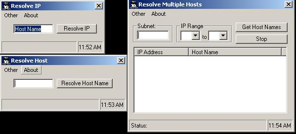



## Resolve IP and Host Names

### Description

It allows you to resolve by IP or Host name. It will also allow you to resolve subnets.
 
### More Info
 

             |
---                |---
**Submitted On**   |2002-02-05 11:57:54
**By**             |[Christopher Young](https://github.com/Planet-Source-Code/PSCIndex/blob/master/ByAuthor/christopher-young.md)
**Level**          |Advanced
**User Rating**    |5.0 (15 globes from 3 users)
**Compatibility**  |VB 6\.0
**Category**       |[Complete Applications](https://github.com/Planet-Source-Code/PSCIndex/blob/master/ByCategory/complete-applications__1-27.md)
**World**          |[Visual Basic](https://github.com/Planet-Source-Code/PSCIndex/blob/master/ByWorld/visual-basic.md)
**Archive File**   |[Resolve\_IP53112252002\.zip](https://github.com/Planet-Source-Code/christopher-young-resolve-ip-and-host-names__1-31508/archive/master.zip)

